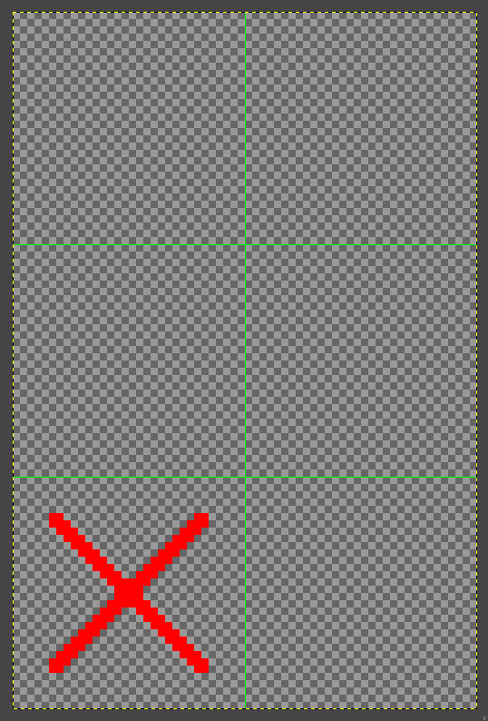

# Image Cropping Script

This script allows you to remove blank tiles from images in a specified directory. It crops out any empty 32x32 pixel tiles (you can change the tile size) from the top, left, and right sides of the images.

BEFORE

<picture>
  
</picture>

AFTER

<picture>
  
</picture>

## Requirements

- Python 3.6 or above

## Installation

1. Clone the repository
2. Navigate to the project directory
3. Install Pillow with pip:

```bash
python3 -m pip install --upgrade pip
python3 -m pip install --upgrade Pillow
```

## Usage

1. Place your input images in the `input` directory.
2. Run the script using the command: `python3 script.py`
3. The cropped images will be saved in the `output` directory, maintaining the same directory structure as the input.

## Configuration

You can customize the following parameters in the script:

- `TILE_SIZE`: The size of each tile in pixels (default: 32)
- `INPUT_DIR`: The input directory where the images are located (default: `input`)
- `OUTPUT_DIR`: The output directory to save the cropped images (default: `output`)

## Contributing

Contributions are welcome! Here are a few ways you can contribute:

- Report bugs or issues
- Suggest new features or enhancements
- Submit pull requests

## License

This project is licensed under the [MIT License](LICENSE).
